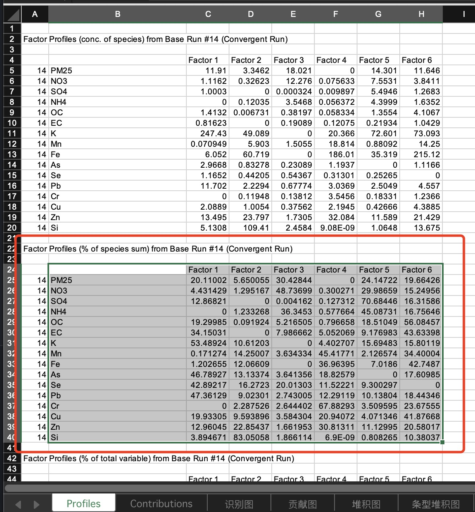
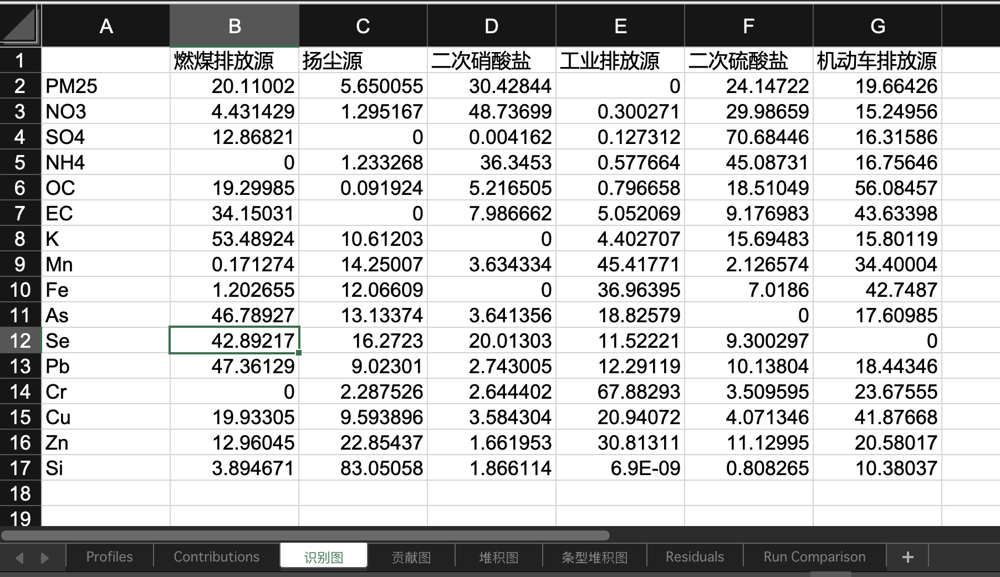
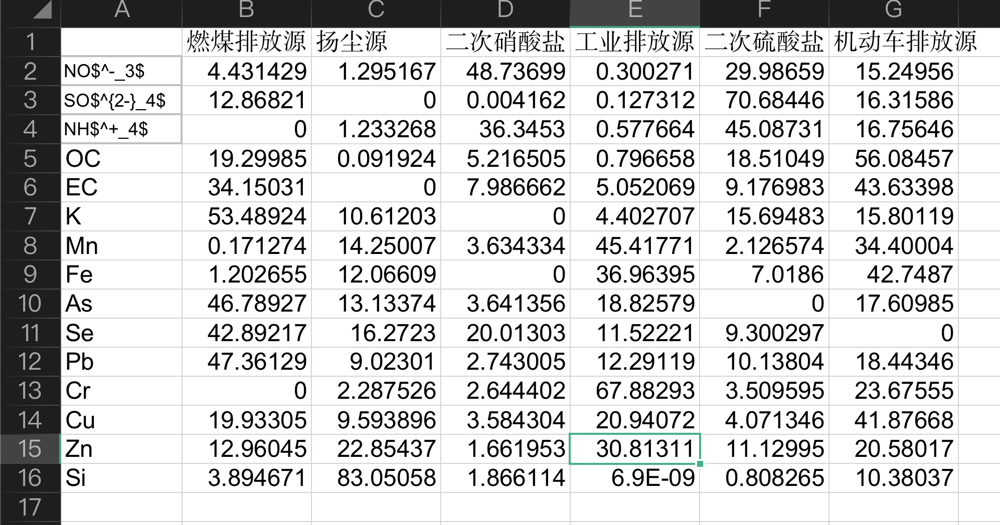
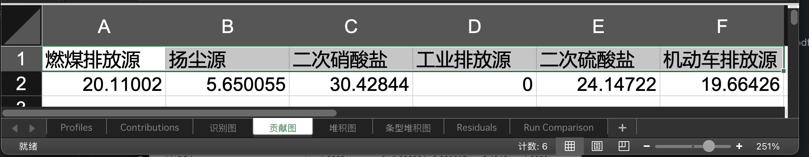
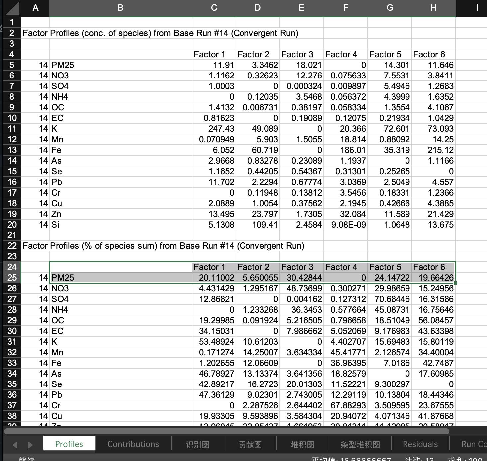
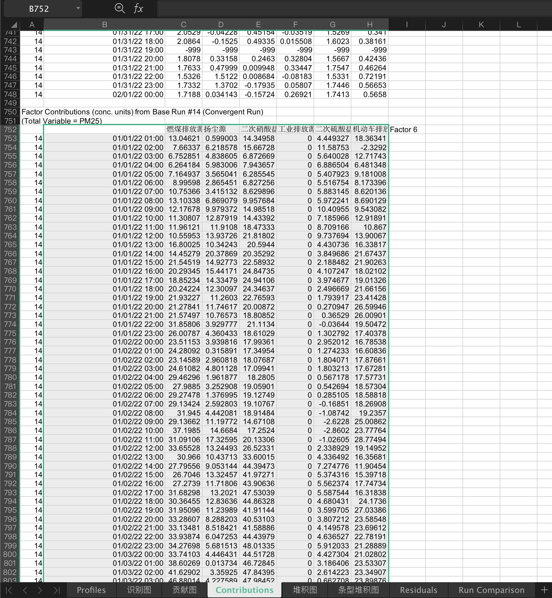
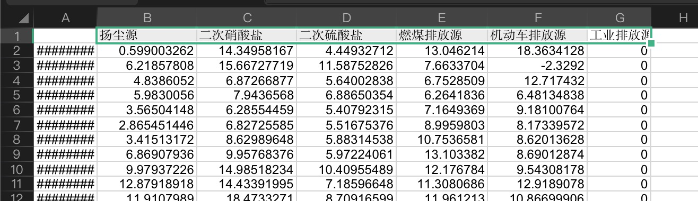
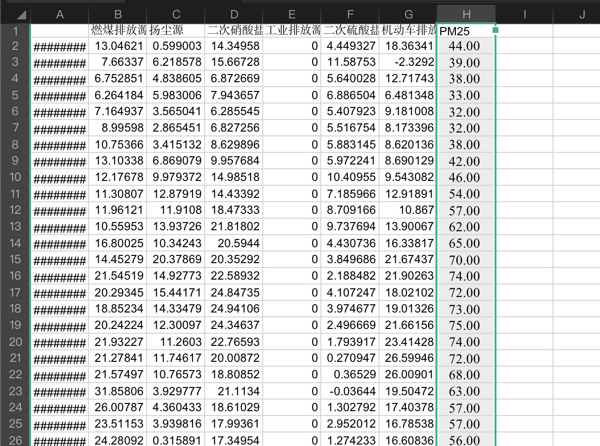
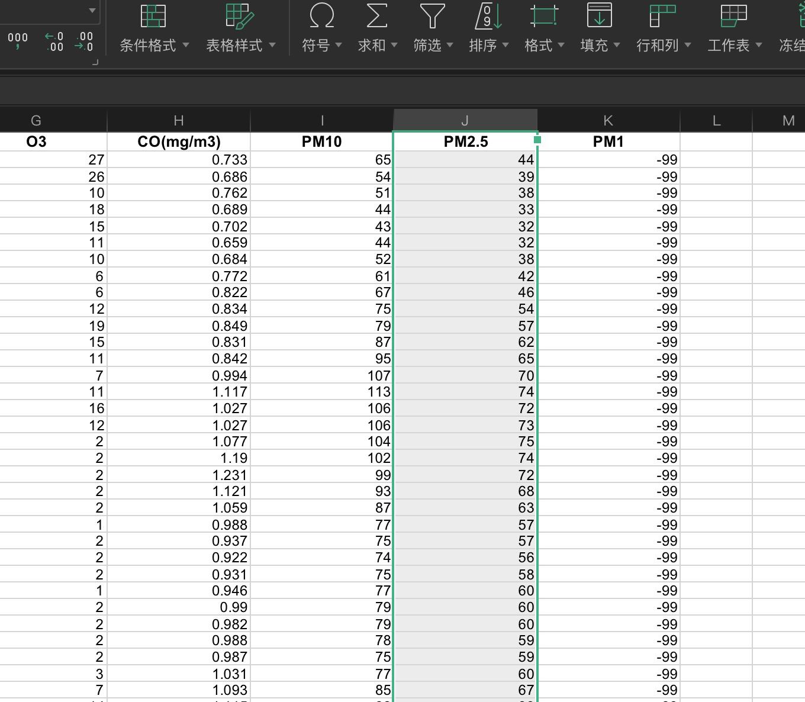
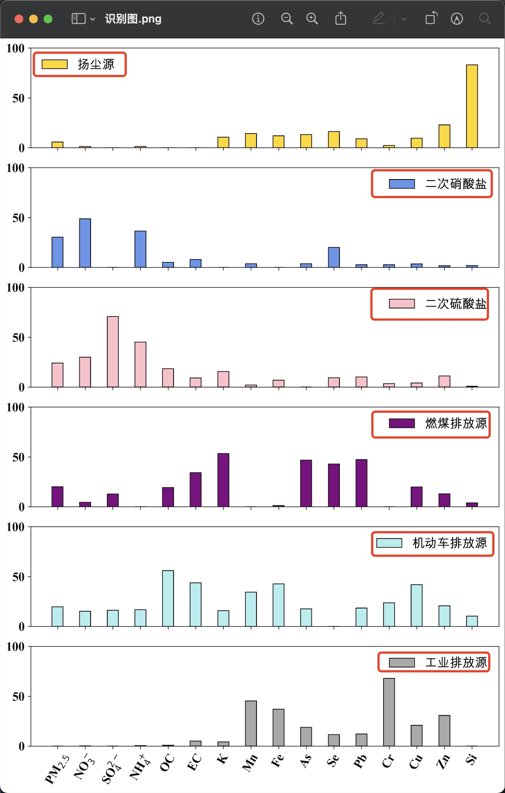

# draw cli help

## 表结构

一个 excel 表格将作为程序的输入之一，这个表格需要包含下面这四个 sheet：


这四个 sheet 的表结构均来自 pmf 模型的输出文件 base.xlsx。

### 识别图 sheet

在 base.xlsx 的 Profiles sheet 中，将图中框选位置作为识别图 sheet 的结构：



每一列的 Factor i 代表着一个源，你要做的是把你识别出的源名称替换掉它们，最终会像下面这样：



此外，PM25 的 25 实际上是下标，NO3 SO4 NH4（以及没出现的 Cl）均有上标或下标。

为了能够正常显示这一内容，我们需要使用 latex：



latex 是一种用来排版的标记语言，它支持书写公式。

我们可以通过 $ 包裹一段文本来使用 latex 公式。

在 latex 中，\_ 表示其后的字符解析为下标，^ 表示上标，{} 用来包裹一个整体，例如：

- \$Cl^-\$ 显示为 $Cl^-$

- \$PM_{2.5}\$ 表示为 $PM_{2.5}$

### 贡献图

贡献图的表结构像这样：



它是 Profile sheet 的这一部分：



同样，你也要把 Factor i 改为你识别出的源名称。

### 堆积图

堆积图的数据来自 Contribution sheet：


这个 sheet 有两段，我们要使用它的第二段数据，大概在 700 多行的位置。

此外，在我们需要的数据部分的第一行 Factor i 的部分，软件输出的会向右错一位，注意把它们向左挪一位，然后像前几个图那样，将 Factor i 改为你识别出的源名称。

对于这个表的结构，注意要额外保证它们从左到右的顺序为 `['扬尘源', '二次硝酸盐', '二次硫酸盐', '燃煤排放源', '机动车排放源', '工业排放源']`。



### 条形堆积图

条形堆积图的表结构，是在堆积图的结构之上加一 PM2.5 列：



这一列来自原始数据（pmf 的输入数据表）卧龙桥小时值：



注意将其更名为 PM25。

## 程序

### 命令行参数

`./draw.py` 是用来画图的程序，它被实现为一个命令行工具。

你可以在命令行中执行 `python3 ./draw.py -h` 来查看它可以接收的命令行参数。

- `-i, --input` 输入的 excel，这就是我们通过上文制作出的包含四个 sheet 的表。
- `-d, --dpi` 输出图片的 dpi，图片将被输出到执行该程序的当前目录下，dpi 越高图形越清晰，默认为 300
- `-w, --whichleft` 该选项用于控制识别图图例的位置，在下图中，当扬尘源的图例在右侧（默认在右侧）时，将会被图形遮挡，此时需要使用该选项，传入需要将图例放置在左侧的源的名称即可。


### 例子

如果你不知道什么是命令行工具，请仔细看这一节的所有示例。

假设我们整理后的 excel 文件名为 `input.xlsx`(我提供了这么一个示例文件)。

一个最简单的使用示例：

```shell
python3 ./draw.py -i ./input.xlsx
```

当我们你需要将二次硝酸盐和扬尘源的图例放置在左侧时，应该执行：

```shell
python3 ./draw.py -i ./input.xlsx -w 扬尘源 二次硝酸盐
```

若需要更改 dpi 为 100：

```shell
python3 ./draw.py -i ./input.xlsx -d 100
```
